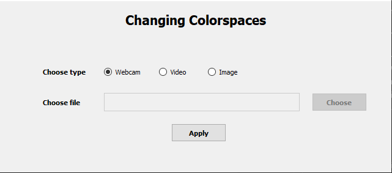
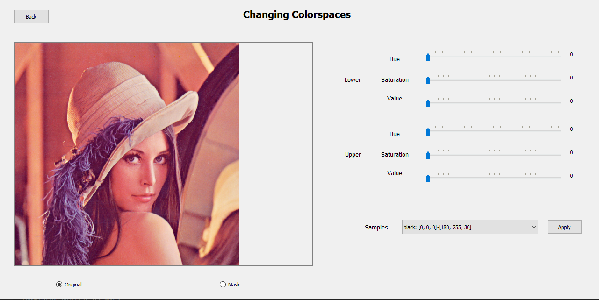
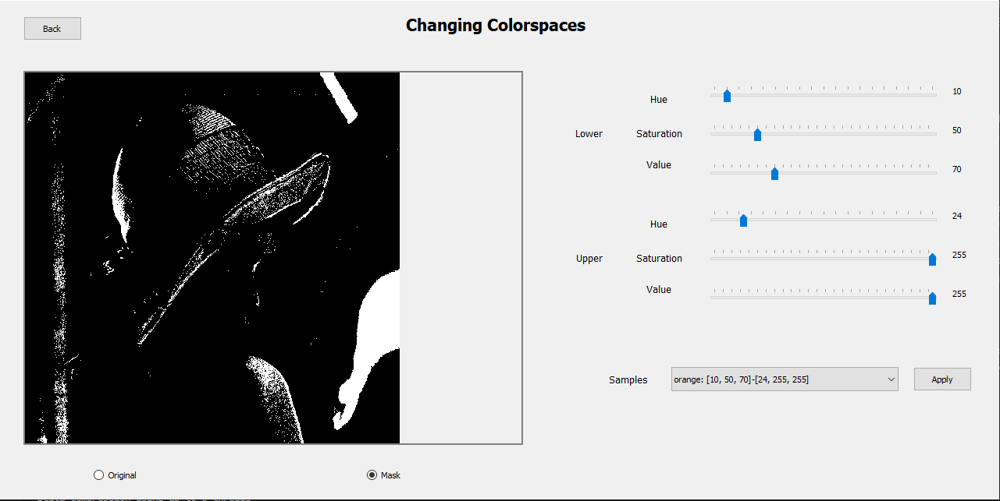
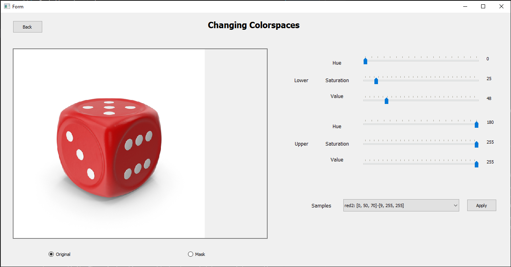
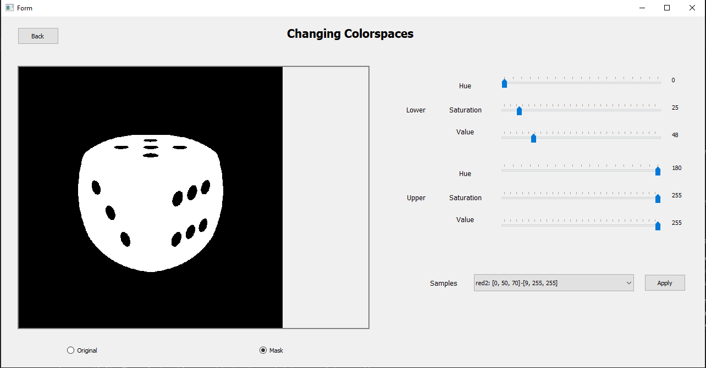

# Changing Colorspaces with UI

## Description
The program provides a UI that makes it easy for users to use [OpenCV2's Changing ColorSpace feature](https://docs.opencv.org/4.x/df/d9d/tutorial_py_colorspaces.html) for object tracking. Help users find a rich color space with an intuitive interface. The program can be used with webcams, videos and images.

## Visuals
### Image of the interface at the beginning of the program



### Main function interface image





## Installation
Clone repository
```bash
git clone https://gitlab.com/quanglvhust/changing-colorspaces-ui
cd changing-colorspaces-ui
```

Install environment
```pip
pip install -r requirements.txt
```

Run program
```python
python main.py
```


## Usage
Use the program to track the red object

Example 


Program



Mask with values HSV Lower(0, 25, 48) - Upper(180, 255, 255)




## Support
Any contributions please create issues. I will help as soon as possible